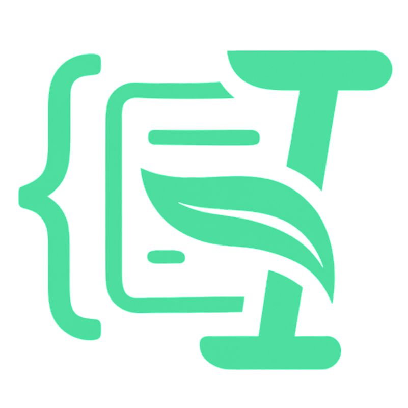

<h1 align="center">Espanso Dynamic Forms</h1>

<div align="center">

[](https://github.com/lumetrium/espanso-dynamic-forms/releases/latest)  

</div>

<div align="center">

[](https://deepwiki.com/lumetrium/espanso-dynamic-forms)

</div>

<br/>

<p align="center">



</p>


<p align="center">
 Create powerful, interactive forms with <a href="https://jsonforms.io/" target="_blank">JSON Forms</a> and<br/>
 insert <a href="https://shopify.github.io/liquid/" target="_blank">Liquid templated</a> output anywhere with <a href="https://espanso.org/" target="_blank">Espanso</a>.
</p>


## About

**Espanso Dynamic Forms** is a helper application that bridges the gap between [Espanso](https://espanso.org/)'s powerful text expansion engine, the sophisticated UI capabilities of [JSON Forms](https://jsonforms.io/), and the flexible templating features of [Liquid](https://shopify.github.io/liquid/).

The workflow:

1. **Trigger**: You type a keyword in any application (e.g., `:email`).
2. **Form Appears**: Espanso runs this application, which displays a rich, interactive form defined by you in either **YAML** or **JSON**.
3. **Fill & Submit**: You fill out the form fields (text inputs, dropdowns, date pickers, etc.) and click "Submit".
4. **Formatted Output**: The app takes your data, renders it using your [Liquid template](https://liquidjs.com), and passes the final text back to Espanso.
5. **Insertion**: Espanso pastes the rendered text right where you typed your trigger.


<p align="center">

<video src="https://github.com/user-attachments/assets/be458a30-e3f3-423e-8b40-cf0d0f21f49a" loop="true" autoplay="autoplay" controls muted />

</p>

## Installation

1. Make sure [Espanso](https://espanso.org/) is installed
2. Download and install **Espanso Dynamic Forms** (this app) from the [releases page](https://github.com/lumetrium/espanso-dynamic-forms/releases)

## Quick Start

### 1. Create an Espanso Trigger

Add a trigger configuration to your Espanso config file. The file location varies by platform:

- **Linux/macOS**: `~/.config/espanso/match/base.yml`
- **Windows**: `%APPDATA%\espanso\match\base.yml`

Example trigger configuration:

```yml
matches:
  - trigger: ":demo"
    replace: "{{output}}"
    force_mode: clipboard
    vars:
      - name: output
        type: script
        params:
          args:
            - C:/Program Files/EspansoDynamicForms/EspansoDynamicForms.exe
            - --form-config
            - \{\{env.EDF_FORMS}}/reply.yml
```

> On Linux use the path `/usr/bin/espanso-dynamic-forms` instead of the Windows path to `.exe` shown above

|Configuration Key|Purpose|
|---|---|
|`trigger`|The text pattern to match (e.g., `:demo`)|
|`replace`|Template for output, uses `{{output}}` variable|
|`force_mode: clipboard`|Required for multiline output insertion|
|`type: script`|Tells Espanso to execute an external program|
|`args`|Command-line arguments passed to the executable|


### 2. Test Demo Form

1. Type `:demo` in any text field (e.g., text editor, browser input)
2. The **Espanso Dynamic Forms** window appears
3. Fill out the form fields
4. Click the **Submit** button
5. The formatted output is inserted at your cursor position

### 3. Create a Custom Form Config

The main power of **Espanso Dynamic Forms** is in creating and using your own custom forms.
So let's create a form config and reference it in the Espanso trigger.

Create a YAML file anywhere (e.g., `C:/forms/test.yml`).
Now, update the `--form-config` argument in the trigger to point to your new form config file.

```yml
matches:
  - trigger: ":demo"
    replace: "{{output}}"
    force_mode: clipboard
    vars:
      - name: output
        type: script
        params:
          args:
            - C:/Program Files/EspansoDynamicForms/EspansoDynamicForms.exe
            - --form-config
            - C:/forms/demo.yml # <-- create a .yml file and put the path here
```

Let's try this minimal `demo.yml` form config:

```yml
schema:
  type: object
  properties:
    subject:
      type: string
    priority:
      type: string
      enum:
        - High
        - Medium
        - Low
  required:
    - subject

uischema:
  type: VerticalLayout
  elements:
    - type: Control
      scope: "#/properties/subject"
      label: Subject
    - type: Control
      scope: "#/properties/priority"
      label: Priority

data:
  subject: "{{clipboard}}"
  priority: Medium

template: |
  Subject: {{subject}}
  Priority: {{priority | upcase}}
```

You can copy the above YAML content into your own config file and tweak it as needed.

| Keyword    | Description                                                                                           |
|------------|---------------------------------------------------------------------------------------------------|
| **schema** | Defines two fields (`subject` as string, `priority` as enum), marks `subject` as required         |
| **uischema** | Arranges fields vertically, each as a `Control` pointing to a schema property via `scope`        |
| **data**   | Sets `subject` to clipboard content, `priority` to "Medium"                                        |
| **template** | Formats output using Liquid syntax, applying `upcase` filter to priority                          |

> Any field in your `schema` becomes available in the `template`.  
> You can also use special tokens like `{{clipboard}}` and `{{env}}`.

<details>
<summary><strong>CLICK HERE TO SEE A MORE ADVANCED EXAMPLE</strong></summary>

````yaml
schema:
  type: object
  properties:
    type:
      type: string
      enum:
        - message
        - email
        - post
        - comment
        - review
    content:
      type: string
      default: "{{clipboard}}"
    draft:
      type: string
    style:
      type: array
      items:
        type: string
    context:
      type: string
    convo:
      type: string
  required:
    - types
    - content

uischema:
  type: Categorization
  elements:
    - type: Category
      label: Content
      elements:
        - type: VerticalLayout
          elements:
            - type: Control
              scope: "#/properties/type"
              label: Help me reply to this
              options:
                format: radio
                vuetify:
                  v-radio-group:
                    inline: true
                    hideDetails: true
            - type: Control
              scope: "#/properties/content"
              options:
                multi: true
            - type: Control
              scope: "#/properties/draft"
              label: My draft response
              options:
                multi: true
                vuetify:
                  v-textarea:
                    rows: 10
            - type: Control
              scope: "#/properties/context"
              label: Additional context
              options:
                multi: true
    - type: Category
      label: Style
      elements:
        - type: Control
          scope: "#/properties/style"
          label: Style guidelines

data:
  type: message
  content: "{{clipboard}}"
  style:
    - Use a conversational, slightly informal style with simple language
    - Use contractions like "you're" and "don't"
    - Prioritize clarity with simple sentence structure

template: |
  Help me reply to this {{type}}:
  ```
  {{content}}
  ```
  
  My draft response:
  ```
  {{draft}}
  ```
  
  
  Style guidelines:
  - {{style | join: '\n- '}}
  
  
  Additional context:
  ```
  {{context}}
  ```
  
````

</details>

## Compare
The following examples show a native Espanso form and its equivalent in Espanso Dynamic Forms config.


### Native form example
<details>
<summary><strong>Click here to view a simple native Espanso form</strong></summary>

```yaml
  - trigger: :email
    replace: |
      Subject: {{form1.subject}}
      Priority: {{form1.priority}}
      
      ---
      
      Hi {{form1.contact_name}},

      Just following up on our conversation about {{form1.subject}}.

      Regards,
      Me
    vars:
      - name: "form1"
        type: form
        params:
          layout: |
            Subject: [[subject]]
            Priority: [[priority]]
            Contact name [[contact_name]],
          fields:
            subject:
              type: text
              multiline: false
              default: "{{clipboard}}"
            priority:
              type: choice
              values:
                - High
                - Medium
                - Low
              default: Medium
            contact_name:
              type: text
              multiline: false
              default: ""
```

</details>

### Equivalent with Espanso Dynamic Forms

<details>
<summary><strong>Click here to view Espanso Dynamic Forms version</strong></summary>

```yml
schema:
  type: object
  properties:
    subject:
      type: string
      default: ""
    priority:
      type: string
      enum:
        - High
        - Medium
        - Low
      default: Medium
    contact_name:
      type: string
      default: ""
  required:
    - subject
    - priority
    - contact_name

uischema:
  type: VerticalLayout
  elements:
    - type: Control
      scope: "#/properties/subject"
      label: Subject
      options:
        multi: false
    - type: Control
      scope: "#/properties/priority"
      label: Priority
      options:
        format: radio
    - type: Control
      scope: "#/properties/contact_name"
      label: Contact Name
      options:
        multi: false

data:
  subject: "{{clipboard}}"
  priority: Medium
  contact_name: ""

template: |
  Subject: {{subject}}
  Priority: {{priority | upcase}}
  
  ---
  
  Hi {{contact_name | capitalize}},

  Just following up on our conversation about {{subject}}.

  Regards,
  Me
```

</details>

Browse the [examples folder](./public/forms) for more sample form configs.


## References
- **Form Syntax**: Learn more about form structure and configuration in the [JSON Forms documentation](https://jsonforms.io/docs)
- **Output Formatting**: Explore [Liquid templating](https://shopify.github.io/liquid/) for dynamic output formatting
- **Trigger Configuration**: Review the [Espanso documentation](https://espanso.org/docs/) for advanced trigger setup
- **UI Components**: Browse [Examples with Vuetify Renderers](https://jsonforms-vuetify-renderers.netlify.app/#/example/main) for component inspiration (note: examples use Vuetify 2, while Espanso Dynamic Forms uses Vuetify 3, but core concepts still apply)


## Platforms
This application is available for:
- **Windows**
- **Linux**

> This app has **NOT** been built or tested on **macOS**.
> However, since this is an Electron app, you may be able to build it for macOS yourself following the standard Electron build process.

---

**Questions or issues?** Please [open an issue](https://github.com/lumetrium/espanso-dynamic-forms/issues/new) on GitHub.

## Check out my other project

<a href="https://chromewebstore.google.com/detail/definer-popup-dictionary/noagjioaihamoljcbelhdlldnmlgnkon?utm_source=espanso-dynamic-forms&utm_medium=referral&utm_content=readme">
  
</a>

**[Definer - Popup Translator & Dictionary](https://chromewebstore.google.com/detail/definer-popup-dictionary/noagjioaihamoljcbelhdlldnmlgnkon?utm_source=espanso-dynamic-forms&utm_medium=referral&utm_content=readme)**  
Instant definitions, translations, search, and AI results for words and phrases you select or type.
