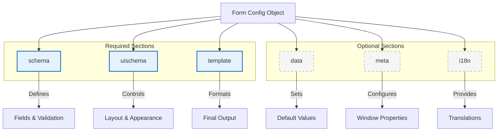

# Form Config

A form config file defines everything about your form: what fields it has, how they look, what default values they contain, and how the output is formatted.

You write form configs in **YAML** or **JSON** format and pass them to Espanso Dynamic Forms using the `--form-config` command-line argument. See [Getting Started](../getting-started/) for setup instructions.

## Structure Overview

Every form config file can have up to **six sections**. Three are required for the form to work, and three are optional:

| Section | Required | Purpose |
|---------|----------|---------|
| [`schema`](./schema) | ✅ Yes | Defines form fields, their types, and validation rules. Based on [JSON Schema](../json-forms/). |
| [`uischema`](./uischema) | ✅ Yes | Controls layout and appearance—how fields are arranged and styled. |
| [`template`](./template) | ✅ Yes | Defines the output format using [Liquid](../liquid/) templating. |
| [`data`](./data) | ❌ No | Sets default values for form fields. Supports dynamic tokens like `{{clipboard}}`. |
| [`meta`](./meta) | ❌ No | Window properties (title, size, position) and form metadata (name, version). |
| [`i18n`](./i18n) | ❌ No | Translations for multi-language support. |



---

## Examples

### Minimal Form

This is the simplest possible form—just enough to work:

```yml
schema:
  type: object
  properties:
    name:
      type: string
      title: 'Name'

uischema:
  type: VerticalLayout
  elements:
    - type: Control
      scope: '#/properties/name'

template: |
  Hello, {{ name }}!
```

This form:
- Has one text field called `name`
- Displays it in a simple vertical layout
- Outputs "Hello, [whatever you typed]!" when submitted

---

### Complete Form

Here's a more realistic example using all six sections:

```yml
meta:
  name: File Text Extractor
  description: Extracts and outputs text content from a selected file.
  version: 1.0.0
  title: Extract Text from File
  width: 500
  height: 400

schema:
  type: object
  required:
    - singleFile
  properties:
    singleFile:
      type: object
      format: file
      i18n: myFile

uischema:
  type: VerticalLayout
  elements:
    - type: Control
      scope: "#/properties/singleFile"
      options:
        accept: "text/*"

data:
  singleFile:
    path: ""

i18n:
  en:
    myFile:
      description: Please upload a text file
      selectedFile: Selected file
      remove: Remove
  ru:
    myFile:
      description: Пожалуйста, загрузите текстовый файл
      selectedFile: Выбранный файл
      remove: Удалить

template: |
  {{singleFile.text}}
```

This form:
- Opens in a 500×400 window titled "Extract Text from File"
- Has a required file upload field that accepts text files
- Supports English and Russian languages
- Outputs the raw text content of the selected file

---

## Ready-Made Forms

Browse the [Forms Library](../library/) for pre-built form configs you can use as starting points for your own forms.

---

## Learn More

Dive deeper into each section:

- **[schema](./schema)** — Field types, validation, arrays, and nested objects
- **[uischema](./uischema)** — Layouts, styling, conditional visibility, and Vuetify options
- **[template](./template)** — Liquid syntax, filters, loops, and conditionals
- **[data](./data)** — Static defaults and dynamic tokens (`{{clipboard}}`, `{{env}}`)
- **[meta](./meta)** — Window size, position, title, and opacity
- **[i18n](./i18n)** — Multi-language translations
