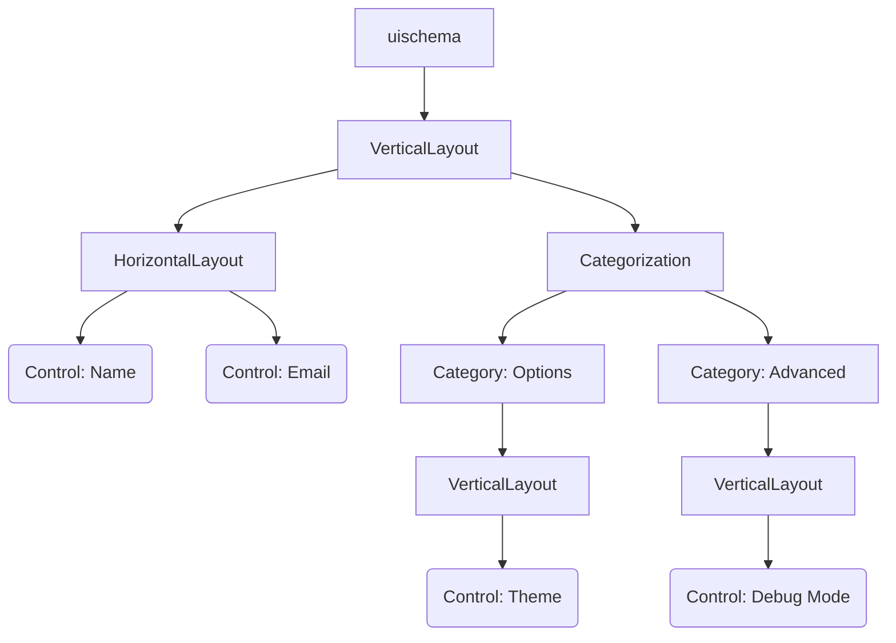

# uischema

The `uischema` section controls how your form looks—the layout, styling, and behavior of each field. While [`schema`](./schema) defines *what* fields exist, `uischema` defines *how* they appear.

> [!WARNING] Required Section
> Every form config must include a `uischema`. Without it, fields won't render.

## How It Works

The UI Schema is a tree structure where you arrange your fields using layouts and controls:

- **Layouts** organize fields visually (vertical stacking, horizontal rows, or tabs)
- **Controls** connect to schema properties and render as input fields

### Hierarchy Visualization



[IMAGE: Side-by-side comparison showing the same three fields rendered with different uischema configurations: left side shows VerticalLayout with fields stacked top-to-bottom, middle shows HorizontalLayout with fields arranged in a row, right side shows Categorization with fields split across two tabs labeled "Basic" and "Advanced"]

## Root Properties

Every UI Schema starts with these properties:

| Property | Type | Required | Description |
|----------|------|----------|-------------|
| `type` | string | Yes | Layout type: `VerticalLayout`, `HorizontalLayout`, or `Categorization` |
| `elements` | array | Yes | Child layouts or controls |
| `label` | string | No | Label text (used with `Category` type) |
| `options` | object | No | Renderer configuration options |
| `rule` | object | No | Conditional visibility rule |

---

## Layout Types

Layouts organize how controls appear. You can nest layouts inside each other for complex arrangements.

### VerticalLayout

Renders child elements vertically in a single column.

```yml
uischema:
  type: VerticalLayout
  elements:
    - type: Control
      scope: "#/properties/field1"
    - type: Control
      scope: "#/properties/field2"
```


### HorizontalLayout

Renders child elements horizontally in a row. Commonly used for grouping related fields side-by-side.

```yml
uischema:
  type: HorizontalLayout
  elements:
    - type: Control
      scope: "#/properties/language"
      label: Language
    - type: Control
      scope: "#/properties/framework"
      label: Framework/Library
```

### Categorization

Creates a tabbed interface where each `Category` becomes a separate tab.

```yml
uischema:
  type: Categorization
  elements:
    - type: Category
      label: Content
      elements:
        - type: VerticalLayout
          elements:
            # controls...
    - type: Category
      label: Style
      elements:
        - type: VerticalLayout
          elements:
            # controls...
```

## Control Elements

Control elements bind [`schema`](./schema.md) properties to input components. 
They are the leaf nodes in the UI Schema tree.

### Control Properties

|Property|Type|Required|Description|
|---|---|---|---|
|`type`|string|Yes|Must be `"Control"`|
|`scope`|string|Yes|JSON pointer to the schema property (e.g., `"#/properties/fieldName"`)|
|`label`|string|No|Display label for the field (overrides schema title)|
|`options`|object|No|Control-specific configuration|
|`rule`|object|No|Conditional visibility rule|

### Scope Syntax

The `scope` property uses JSON Pointer syntax to reference schema properties:

|Scope Pattern|References|
|---|---|
|`"#/properties/name"`|Top-level property `name`|
|`"#/properties/user/properties/email"`|Nested property `user.email`|
|`"#/properties/items/items"`|Array items schema|

## Options System

The `options` object on controls and layouts provides fine-grained configuration. 
Options are passed to the JSON Forms renderer and can control both JSON Forms behavior and Vuetify component properties.

### Common JSON Forms Options

|Option|Type|Applies To|Description|
|---|---|---|---|
|`format`|string|Control|Input format: `"radio"`, `"select"`, `"date"`, `"time"`, `"date-time"`|
|`multi`|boolean|Control|Enable multiline input (renders as `VTextarea` instead of `VTextField`)|
|`dateFormat`|string|Control (date)|Display format for date pickers (e.g., `"DD.MM.YYYY"`)|
|`dateSaveFormat`|string|Control (date)|Format for saving date values (e.g., `"YYYY-MM-DD"`)|

### Format Option

The `format` option customizes how certain fields are rendered, for example:

```yml
# Radio buttons (enum field)
- type: Control
  scope: "#/properties/priority"
  options:
    format: radio

# Dropdown select (enum field)
- type: Control
  scope: "#/properties/language"
  options:
    format: select

# Multiline textarea
- type: Control
  scope: "#/properties/description"
  options:
    multi: true

# Date picker with custom formats
- type: Control
  scope: "#/properties/mydate"
  options:
    dateFormat: DD.MM.YYYY
    dateSaveFormat: YYYY-MM-DD
```

### Vuetify Option

The `vuetify` option allows direct configuration of underlying Vuetify components. This provides access to the full Vuetify component API.

#### Vuetify Options Structure

```yml
options:
  vuetify:
    v-component-name:
      propertyName: value
      anotherProperty: value
```

The component name corresponds to the Vuetify component being rendered (e.g., `v-text-field`, `v-select`, `v-radio-group`).

#### Component Mapping

|Schema Type|Format|Default Component|Vuetify Option Key|
|---|---|---|---|
|`string`|-|`VTextField`|`v-text-field`|
|`string`|`multi: true`|`VTextarea`|`v-textarea`|
|`string` (enum)|`radio`|`VRadioGroup`|`v-radio-group`|
|`string` (enum)|`select`|`VAutocomplete`|`v-autocomplete`|
|`string` (enum)|-|`VSelect`|`v-select`|
|`string`|`date`|Custom Date Control|`v-text-field` (wrapped)|
|`boolean`|-|`VCheckbox`|`v-checkbox`|
|`array`|-|Custom Array Control|Various|

#### Common Vuetify Properties

```yml
# Radio group configuration
options:
  format: radio
  vuetify:
    v-radio-group:
      inline: true        # Display radios horizontally
      hideDetails: true   # Hide validation messages

# Textarea configuration
options:
  multi: true
  vuetify:
    v-textarea:
      rows: 10           # Initial row count
      autoGrow: true     # Expand automatically

# Select/Autocomplete configuration
options:
  format: select
  vuetify:
    v-autocomplete:
      hideDetails: true
      clearable: true

# Text field configuration
options:
  vuetify:
    v-text-field:
      density: compact
      hideDetails: auto
```


## Rules and Conditional Visibility

Rules control when elements are visible or enabled based on the values of other form fields. The rule system uses JSON Schema for condition matching.

### Rule Structure

```yml
- type: Control
  scope: "#/properties/errorMessage"
  rule:
    effect: SHOW     # or HIDE, ENABLE, DISABLE
    condition:
      scope: "#/properties/taskType"
      schema:
        enum:
          - debug
          - fix
```

### Rule Properties

|Property|Type|Required|Description|
|---|---|---|---|
|`effect`|string|Yes|Action to take: `SHOW`, `HIDE`, `ENABLE`, `DISABLE`|
|`condition`|object|Yes|Condition specification|
|`condition.scope`|string|Yes|JSON pointer to the property to check|
|`condition.schema`|object|Yes|JSON Schema that the property value must match|

### Rule Effects

|Effect|Description|
|---|---|
|`SHOW`|Show the element when condition is true, hide otherwise|
|`HIDE`|Hide the element when condition is true, show otherwise|
|`ENABLE`|Enable the element when condition is true, disable otherwise|
|`DISABLE`|Disable the element when condition is true, enable otherwise|

### Condition Schemas

The `condition.schema` uses standard JSON Schema syntax:

```yml
# Show if field equals specific value
condition:
  scope: "#/properties/type"
  schema:
    const: "email"

# Show if field is one of multiple values
condition:
  scope: "#/properties/taskType"
  schema:
    enum:
      - debug
      - fix
      - test

# Show if boolean is true
condition:
  scope: "#/properties/advanced"
  schema:
    const: true

# Show if number is in range
condition:
  scope: "#/properties/priority"
  schema:
    minimum: 7
    maximum: 10
```

## Complete UI Schema Examples

### Basic Vertical Layout

```yml
uischema:
  type: VerticalLayout
  elements:
    - type: Control
      scope: "#/properties/subject"
      label: Subject
      options:
        multi: false
    - type: Control
      scope: "#/properties/priority"
      label: Priority
      options:
        format: radio
    - type: Control
      scope: "#/properties/contact_name"
      label: Contact Name
```

### Categorized Form with Tabs

```yml
uischema:
  type: Categorization
  elements:
    - type: Category
      label: Content
      elements:
        - type: VerticalLayout
          elements:
            - type: Control
              scope: "#/properties/type"
              label: Help me reply to this
              options:
                format: radio
                vuetify:
                  v-radio-group:
                    inline: true
                    hideDetails: true
            - type: Control
              scope: "#/properties/content"
              options:
                multi: true
    - type: Category
      label: Style
      elements:
        - type: Control
          scope: "#/properties/style"
          label: Style guidelines
```


### Horizontal Field Groups

```yml
uischema:
  type: VerticalLayout
  elements:
    - type: HorizontalLayout
      options:
        vuetify:
          v-col:
            padding: 0
      elements:
        - type: Control
          scope: "#/properties/language"
          label: Language
          options:
            format: select
            vuetify:
              v-autocomplete:
                hideDetails: true
        - type: Control
          scope: "#/properties/framework"
          label: Framework/Library
          options:
            format: select
            vuetify:
              v-autocomplete:
                hideDetails: true
```

### Date Control with Custom Formatting

```yml
uischema:
  type: VerticalLayout
  elements:
    - type: Control
      scope: "#/properties/mydate"
      label: Select Date
      options:
        dateFormat: DD.MM.YYYY
        dateSaveFormat: YYYY-MM-DD
```


## Best Practices

### Label Configuration

Labels can be defined in three places (in order of precedence):

1. UI Schema `label` property (highest priority)
2. Schema `title` property
3. Property name (if no title/label provided)

```yml
# Schema defines title
schema:
  properties:
    email:
      type: string
      title: Email Address  # Used if no UI Schema label

# UI Schema overrides
uischema:
  - type: Control
    scope: "#/properties/email"
    label: Your Email    # Takes precedence over schema title
```

### Layout Organization

- Use `Categorization` for forms with multiple logical sections (3+ sections)
- Use `VerticalLayout` for simple forms or within categories
- Use `HorizontalLayout` sparingly for related fields (e.g., first/last name, language/framework)
- Nest layouts no more than 3-4 levels deep for maintainability

### Vuetify Options
- Set `rows` property on `VTextarea` for expected content size
- Use `hideDetails: true` on inputs where validation messages are not critical to reduce visual clutter
- Use `inline: true` on `VRadioGroup` for horizontal radio button layouts
- Use `clearable: true` on select/autocomplete fields to allow easy clearing of selections
- Use `autoGrow: true` on textareas to expand with content

