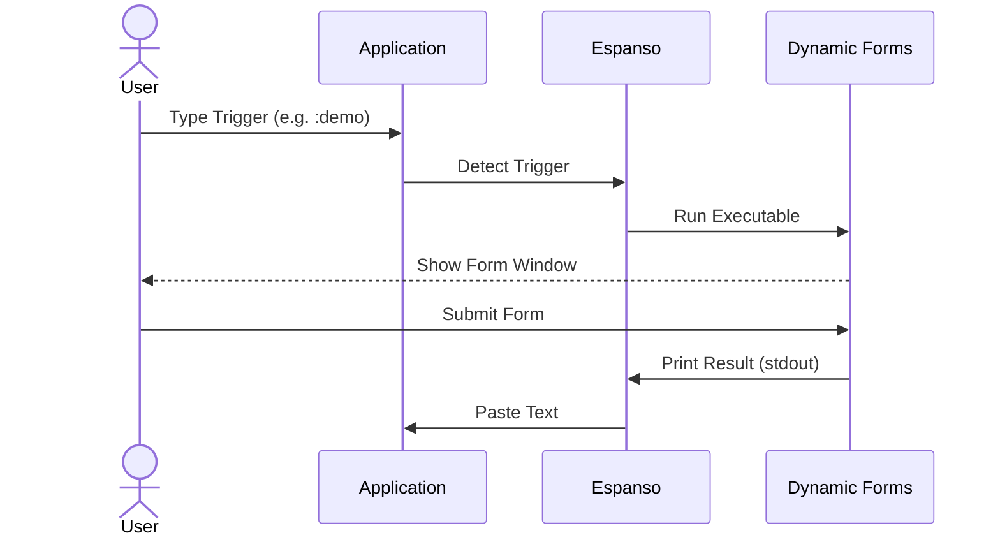

# Getting Started

This guide walks you through creating your first Espanso trigger that launches a dynamic form. By the end, you'll have a working form that captures input and inserts formatted text.

## Prerequisites

Before starting, make sure you have:

1. **[Espanso](https://espanso.org/)** installed and running ([GitHub](https://github.com/espanso/espanso))
2. **[Espanso Dynamic Forms](https://github.com/lumetrium/espanso-dynamic-forms)** installed (see [Installation guide](../install/))

> [!TIP] Verify Espanso is working
> Type a simple trigger like `:espanso` in any text field. If Espanso expands it to "Hi there!", you're ready to continue.

## Quick Start 

### Step 1: Create an Espanso Trigger

Add a trigger to your Espanso config file. The file location depends on your operating system:

| Platform | Config File Location |
|----------|---------------------|
| Windows | `%APPDATA%\espanso\match\base.yml` |
| Linux | `~/.config/espanso/match/base.yml` |

Open the file in a text editor and add this trigger configuration:

```yml
matches:
  - trigger: ":demo"
    replace: "{{output}}"
    force_mode: clipboard
    vars:
      - name: output
        type: script
        params:
          args:
            - C:/Program Files/Espanso Dynamic Forms/EDF.exe
            - --form-config
            - \{\{env.EDF_FORMS}}/demo.yml
```

> [!NOTE] Linux users
> Replace the Windows executable path with `/usr/bin/edf`

**What each setting does:**

| Setting | Purpose                                                                 |
|---------|-------------------------------------------------------------------------|
| `trigger` | The text pattern that activates this form (`:demo`)                     |
| `replace` | The template for output, uses the `{{output}}` variable from the script |
| `force_mode: clipboard` | Required for multi-line output to paste correctly                       |
| `type: script` | Tells Espanso to run an external program                                |
| `args` | Command-line arguments: the executable path and the form config file    |

> [!WARNING] Why `force_mode: clipboard`?
> Without this setting, multi-line output may not insert correctly in all applications. Always include it for Espanso Dynamic Forms triggers.

---

### Step 2: Test the Demo Form

1. Open any application with a text field (text editor, browser, email client)
2. Type `:demo` and wait for the form to appear
3. Fill out the form fields
4. Click the **Submit** button
5. The formatted output appears at your cursor position


> [!TIP] Form not appearing?
> - Make sure Espanso is running (check your system tray)
> - Restart Espanso after editing the config file
> - Check the executable path matches your installation location

---

### Step 3: Create Your Own Form

The real power of Espanso Dynamic Forms lies in creating custom forms tailored to your workflow. Let's create a simple one.

**1. Create a form config file**

Create a new file anywhere on your system (e.g., `C:/forms/test.yml` on Windows or `~/forms/test.yml` on Linux).

**2. Add this content to the file:**

```yml
schema:
  type: object
  properties:
    subject:
      type: string
    priority:
      type: string
      enum:
        - High
        - Medium
        - Low
  required:
    - subject

uischema:
  type: VerticalLayout
  elements:
    - type: Control
      scope: "#/properties/subject"
      label: Subject
    - type: Control
      scope: "#/properties/priority"
      label: Priority

data:
  subject: "{{clipboard}}"
  priority: Medium

template: |
  Subject: {{subject}}
  Priority: {{priority | upcase}}
```

**3. Update your Espanso trigger** to point to your new file:

```yml
matches:
  - trigger: ":myform"
    replace: "{{output}}"
    force_mode: clipboard
    vars:
      - name: output
        type: script
        params:
          args:
            - C:/Program Files/Espanso Dynamic Forms/EDF.exe
            - --form-config
            - C:/forms/test.yml
```

**Understanding the form config:**

| Section | What It Does |
|---------|--------------|
| `schema` | Defines the form fields and their types. Here we have a required text field (`subject`) and an optional dropdown (`priority`) with three choices. |
| `uischema` | Controls how fields appear. `VerticalLayout` stacks them vertically, and each `Control` connects to a field defined in the schema. |
| `data` | Sets default values. `{{clipboard}}` pre-fills the subject with your clipboard contents. |
| `template` | Defines the output format using [Liquid syntax](../liquid/). The `upcase` filter converts priority to uppercase. |

### Troubleshooting

If the form doesn't appear:
1.  **Check Espanso Log:** In the Espanso menu, check "Log" for errors.
2.  **Debug via Terminal:** You can run the command manually in a terminal to see if it works outside Espanso. See [CLI Reference](../reference/cli) for details.

---

## How It Works Under the Hood

Understanding the data flow can help you troubleshoot and build advanced workflows:

1.  **Trigger:** Espanso detects your keyword (e.g., `:demo`).
2.  **Execute:** Espanso runs the `EspansoDynamicForms.exe` executable with the path to your form config.
3.  **Render:** The app reads the `.yml` config, resolving any templated paths.
4.  **Visualize:** The window opens, rendering the form controls defined in `schema` and `uischema`.
5.  **Output:** When you click Submit, the app processes the `template` and prints the result to standard output (`stdout`).
6.  **Capture:** Espanso captures this output and pastes it into your active application.



---

## Next Steps


Now that you have a working form, explore these topics to build more powerful forms:

- **[Form Config](../form-config/)** — Deep dive into all six sections of a form config file
- **[Schema](../form-config/schema)** — Learn about field types, validation, and complex data structures
- **[UI Schema](../form-config/uischema)** — Create tabbed interfaces, conditional fields, and custom layouts
- **[Liquid Templating](../liquid/)** — Master filters, conditionals, and loops for dynamic output
- **[Environment Variables](../env/)** — Pass dynamic data into your forms
- **[Example Forms](../library/)** — Browse ready-made forms for common use cases
