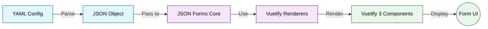

# JSON Forms

[JSON Forms](https://jsonforms.io) is an open-source library that generates forms from JSON Schema definitions. Espanso Dynamic Forms uses it under the hood to render your forms.

**The good news:** You don't need to learn JSON Forms in depth. This documentation covers everything you need. But if you want to explore advanced features, the official JSON Forms docs are a great resource.

> [!NOTE] YAML Works Too
> Despite the name "JSON Forms," you can write your form configs in YAML (which is easier to read). Espanso Dynamic Forms converts YAML to JSON internally.



## How it works

In your form config file, you define a `schema` that describes the structure of the data you want to collect, and a `uischema` that defines how the form should be rendered.
You can also provide `data` to pre-fill the form with existing values.

When the form is rendered, JSON Forms generates the appropriate input fields based on the schema and uischema definitions.

Here is a simple form config example:

```yaml
schema:
  type: object
  properties:
    firstName:
      type: string
      minLength: 2
    age:
      type: integer
      minimum: 0
  required:
    - firstName

uischema:
  type: VerticalLayout
  elements:
    - type: Control
      scope: '#/properties/firstName'
      label: First Name
    - type: Control
      scope: '#/properties/age'
      label: Age

data:
  firstName: John
  age: 30
```

In this example, the `schema` defines an object with two properties: `firstName` (a required string with a minimum length of 2) and `age` (an optional integer with a minimum value of 0).

The `uischema` specifies a vertical layout with two controls for the `firstName` and `age` properties, each with a corresponding label.

When the form is rendered, it will display input fields for "First Name" and "Age", pre-filled with the values "John" and "30", respectively.

> [!Note]
> This is a simplified form config that does not include the required top-level `template` property. 
> In a real config, you would also need to define a `template` to specify how the collected data should be formatted when the form is submitted.
> More on that later in the [Form Config](../form-config/) section.

## UI Framework
JSON Forms provides its own rendering engine which supports multiple UI frameworks for rendering forms.

Espanso Dynamic Forms uses [Vuetify 3](https://vuetifyjs.com/en/components/all/) – a modern and responsive UI framework that follows [Material Design](https://m3.material.io).

This is important because not all JSON Forms features are available in every UI framework. You can browse the [Renderer sets](https://jsonforms.io/docs/renderer-sets/)
documentation to see which features are supported by the Vuetify renderer.

## Forms Elements
JSON Forms provides a variety of built-in form elements (controls and layouts) that you can use in your forms.
These include standard input types like text fields, checkboxes, radio buttons, dropdowns, and more complex elements like arrays and objects.

Espanso Dynamic Forms also includes some custom renderers to provide additional functionality.
To learn more about the available form elements, check out the [Form Elements](../form-elements/) page.


## Official Resources and Examples
- [JSON Forms documentation](https://jsonforms.io/docs/) – Official documentation for JSON Forms
- [JSON Forms examples](https://jsonforms.io/examples/basic) – Official examples showcasing various features of JSON Forms
- [JSON Forms Vuetify examples](https://jsonforms-vuetify-renderers.netlify.app/#/example/main) – Examples specifically using the Vuetify renderer. Examples there use Vuetify 2, but all the same concepts still apply to Vuetify 3.

## Further Reading

- **[Form Config](../form-config/)** — Detailed explanations of each section in a form config file
- **[Form Elements](../form-elements/)** — Overview of available controls and layouts
- **[Forms Library](../library/)** — Collection of ready-made form configs for common use cases
